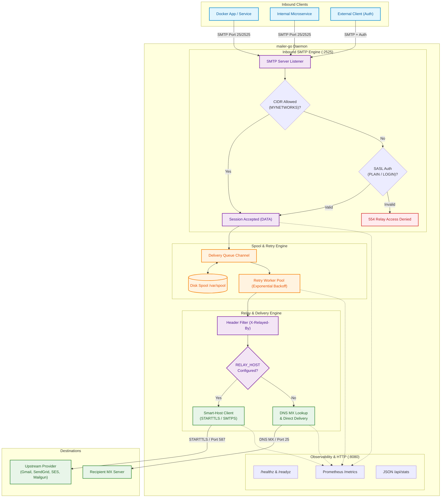

# mailer-go

[](https://golang.org)
[](Dockerfile)
[](cmd/mailer-go/main.go)
[](LICENSE)

A high-performance, lightweight, and modern **SMTP Smart-Host Relay & Direct MX Mailer** written in Go.

Designed as a drop-in, zero-overhead replacement for containerized **Postfix** relays (such as `bokysan/docker-postfix` or `juanluisbaptiste/docker-postfix`) without complex Linux daemon setups, chroot jails, or heavy configuration files.

---

## Highlights

- **Postfix-Compatible Security (`mynetworks`)**: Native CIDR IP subnet whitelisting (`ALLOWED_NETWORKS`) allowing internal microservices and Docker containers to relay emails without credentials.
- **SASL Authentication**: Built-in `PLAIN` and `LOGIN` SASL support for external authenticated clients and enterprise upstream relays.
- **Dual Delivery Modes**:
  - **Smart-Host Outbound Relay**: Forward emails to upstream providers (Gmail, SendGrid, Amazon SES, Mailgun, Office 365, etc.) via opportunistic STARTTLS (port 587/25) or direct TLS/SMTPS (port 465).
  - **Direct MX Delivery**: Automatic DNS MX resolution and direct opportunistic TLS delivery if `RELAY_HOST` is omitted.
- **Resilient Spooling & Retry Queue**: In-memory worker pool with optional persistent disk spooling and exponential backoff retry for network resilience.
- **Built-in Observability**: Native HTTP server providing `/healthz`, `/readyz`, JSON `/api/stats`, and Prometheus metrics at `/metrics`.
- **Minimal Footprint**: Multi-stage container build yielding a `< 15MB` image and `< 15MB RAM` runtime consumption running as an unprivileged user (`appuser`).

---

## Quick Start

### Using Docker Compose (Recommended)

Create a `docker-compose.yml` file:

```yaml
services:
  mailer-go:
    image: mailer-go:latest
    build: .
    container_name: mailer-go
    restart: unless-stopped
    ports:
      - "25:2525"      # Map host SMTP port 25 to container 2525
      - "8080:8080"    # Health & Prometheus metrics port
    environment:
      - SERVER_LISTEN_ADDR=:2525
      - SERVER_HOSTNAME=mailer.local
      - ALLOWED_NETWORKS=127.0.0.0/8,10.0.0.0/8,172.16.0.0/12,192.168.0.0/16
      # Outbound Smart-Host Relay (Example: Gmail)
      - RELAY_HOST=smtp.gmail.com
      - RELAY_PORT=587
      - RELAY_USER=your-email@gmail.com
      - RELAY_PASSWORD=your-app-password
      - RELAY_AUTH_TYPE=AUTO
      - RELAY_TLS_TYPE=AUTO
      # Spooling & Queue
      - QUEUE_ENABLED=true
      - QUEUE_SPOOL_DIR=/var/spool/mailer-go
      - LOG_LEVEL=info
    volumes:
      - mailer-spool:/var/spool/mailer-go

volumes:
  mailer-spool:
```

Start the service:
```bash
docker compose up -d
```

> [!TIP]
> When running inside a shared Docker network, other service containers can simply use `mailer-go:2525` (or `mailer-go:25`) as their SMTP host without any username or password.

---

### Running Standalone Binary

```bash
# Clone the repository
git clone https://github.com/khw315/mailer-go.git
cd mailer-go

# Copy environment template
cp .env.example .env

# Run automated tests
go test ./...

# Start mailer-go
go run ./cmd/mailer-go
```

---

## Configuration Reference

### Postfix Environment Mapping

| Postfix Variable | mailer-go Variable | Default | Description |
| :--- | :--- | :--- | :--- |
| `MYNETWORKS` | `ALLOWED_NETWORKS` | `127.0.0.0/8, 10.0.0.0/8, 172.16.0.0/12, 192.168.0.0/16` | CIDR networks allowed to relay without authentication |
| `RELAYHOST` | `RELAY_HOST` | `""` *(Direct MX)* | Upstream SMTP relay host |
| `RELAY_PORT` | `RELAY_PORT` | `587` | Upstream relay port (`587` for STARTTLS, `465` for SMTPS) |
| `SMTP_USERNAME` / `RELAY_USER` | `RELAY_USER` | `""` | Upstream authentication username |
| `SMTP_PASSWORD` / `RELAY_PASSWORD` | `RELAY_PASSWORD` | `""` | Upstream authentication password / API key |
| `MESSAGE_SIZE_LIMIT` | `SERVER_MAX_MESSAGE_SIZE` | `26214400` *(25MB)* | Max message size in bytes |
| `MASQUERADE_DOMAINS` | `SENDER_OVERRIDE` | `""` | Optional envelope `MAIL FROM` override |
| `SMTP_USER_PASS` | `INBOUND_USERS` | `""` | Client auth list in format `user1:pass1,user2:pass2` |
| `SMTP_PORT` | `SERVER_LISTEN_ADDR` | `:2525` | Inbound SMTP listening address |

---

## Provider Configuration Examples

### Gmail
```env
RELAY_HOST=smtp.gmail.com
RELAY_PORT=587
RELAY_USER=youraccount@gmail.com
RELAY_PASSWORD=xxxx-xxxx-xxxx-xxxx # Google 16-digit App Password
RELAY_TLS_TYPE=STARTTLS
```

### SendGrid
```env
RELAY_HOST=smtp.sendgrid.net
RELAY_PORT=587
RELAY_USER=apikey
RELAY_PASSWORD=SG.your_api_key_here
RELAY_TLS_TYPE=STARTTLS
```

### Amazon SES
```env
RELAY_HOST=email-smtp.us-east-1.amazonaws.com
RELAY_PORT=587
RELAY_USER=YOUR_SES_SMTP_USERNAME
RELAY_PASSWORD=YOUR_SES_SMTP_PASSWORD
RELAY_TLS_TYPE=STARTTLS
```

### Direct MX Delivery (No Smart-Host)
Leave `RELAY_HOST` empty to enable direct DNS MX delivery:
```env
RELAY_HOST=
```

---

## Testing & Verification

### Test via Python
```python
import smtplib
from email.mime.text import MIMEText

msg = MIMEText("Test message content from mailer-go relay.")
msg["Subject"] = "Test Email"
msg["From"] = "app@internal.local"
msg["To"] = "recipient@example.com"

with smtplib.SMTP("127.0.0.1", 2525) as server:
    server.send_message(msg)
    print("Email successfully accepted by relay!")
```

### Test via CLI (`swaks`)
```bash
swaks --to recipient@example.com --from app@internal.local --server 127.0.0.1:2525
```

---

## Monitoring & Health Checks

- **Liveness & Readiness**:
  - `GET http://localhost:8080/healthz` -> `{"status":"healthy","uptime":"1h24m10s"}`
  - `GET http://localhost:8080/readyz` -> `ok`
- **Prometheus Metrics**:
  - `GET http://localhost:8080/metrics`
    ```promql
    # HELP mailer_uptime_seconds Total time the server has been running in seconds.
    # TYPE mailer_uptime_seconds gauge
    mailer_uptime_seconds 5040.25

    # HELP mailer_emails_received_total Total number of emails received from inbound clients.
    # TYPE mailer_emails_received_total counter
    mailer_emails_received_total 128

    # HELP mailer_emails_relayed_total Total number of emails successfully relayed to upstream.
    # TYPE mailer_emails_relayed_total counter
    mailer_emails_relayed_total 128

    # HELP mailer_queue_length Current number of messages waiting in spool queue.
    # TYPE mailer_queue_length gauge
    mailer_queue_length 0
    ```

---

## Architecture Diagram


